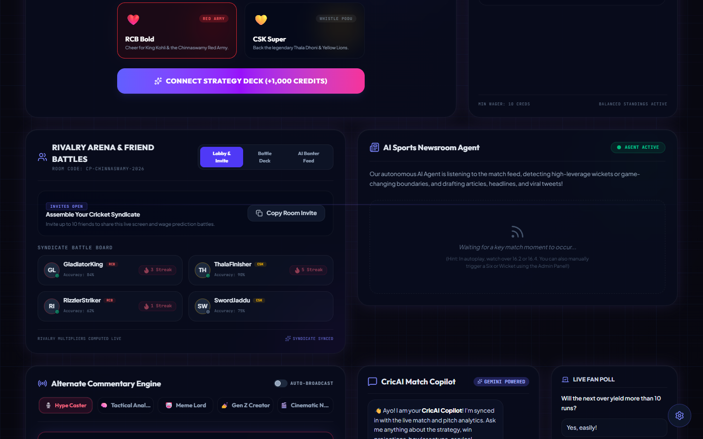
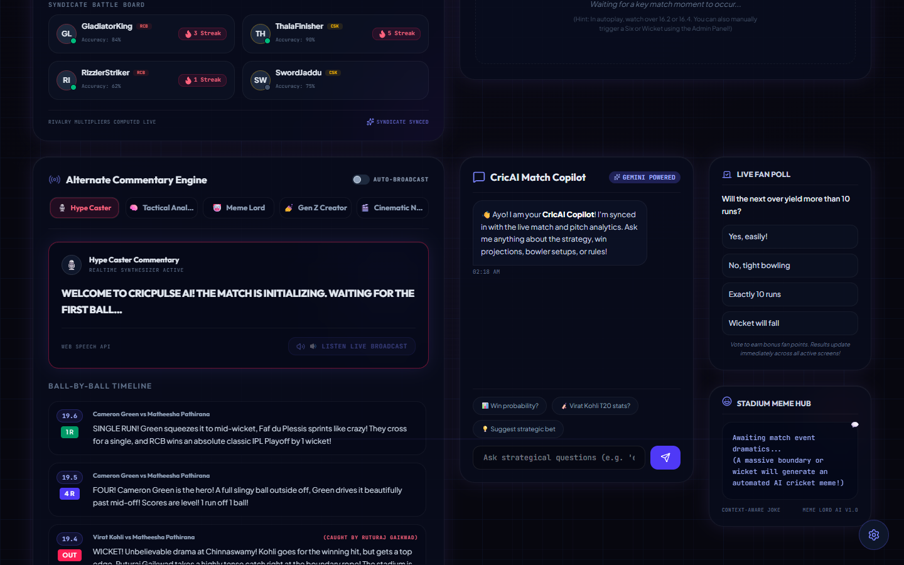
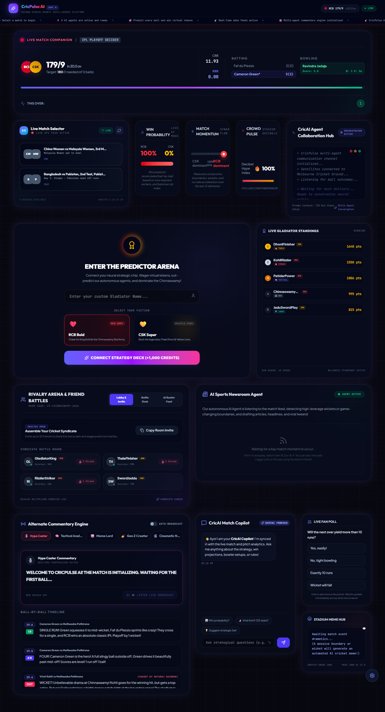

# CricPulse AI 🏏⚡
### GDG Agentic Premier League — Patna (May 18th, 2026) 🏆
**A Second-Screen Sports Intelligence Platform**

<p align="left">
  <a href="https://cricpulse-frontend-620647928221.asia-south1.run.app">
    
  </a>
  <a href="https://cricpulse-backend-620647928221.asia-south1.run.app/health">
    
  </a>
</p>

> **Problem Statement:** *Design a system that enhances how users experience live sporting events beyond passive viewing. The solution should create meaningful second-screen interactions during matches, enabling fans to engage with key moments, participate in real-time activities, and feel more connected to the game as it unfolds.*

**CricPulse AI** is an AI-powered live cricket companion that transforms passive viewing into an immersive, interactive experience through multi-agent AI commentary, real-time predictions, fan rivalry rooms, and autonomous sports storytelling.

---

## 🚀 Live Demo

| Component | Local | Production (GCP) |
|-----------|-------|-----------------|
| **Frontend (App)** | `http://localhost:5173` | [Play Here!](https://cricpulse-frontend-620647928221.asia-south1.run.app) (Cloud Run) |
| **Backend (API)**  | `http://localhost:5000` | [Backend URL](https://cricpulse-backend-620647928221.asia-south1.run.app) (Cloud Run) |
| **Health Check**   | `http://localhost:5000/health` | [Status API](https://cricpulse-backend-620647928221.asia-south1.run.app/health) |
| **Live API**       | `http://localhost:5000/api/live-matches` | [Match JSON](https://cricpulse-backend-620647928221.asia-south1.run.app/api/live-matches) |

---

## 📸 App Gallery

Here is a visual tour of the **CricPulse AI** second-screen companion:

<p align="center">
  
  <br>
  <em>Figure 1: The Main Interactive Dashboard featuring live ticker, real-time simulated commentary, and 5 distinct AI agent commentators.</em>
</p>

<br>

<p align="center">
  
  <br>
  <em>Figure 2: The Agent Thoughts Terminal (displaying internal reasoning of Gemini-powered agents), Rivalry Rooms (fan chats & banter), and the Predict-the-Ball Arena.</em>
</p>

<br>

<p align="center">
  
  <br>
  <em>Figure 3: Full page layout demonstrating responsive grid architecture designed for second-screen interactions.</em>
</p>


## ✨ Feature Matrix

| Feature | Status | Description |
|---------|--------|-------------|
| 🎙️ Alternate Commentary Engine | ✅ Live | 5 AI personas — Hype, Tactical, Meme Lord, Gen Z, Cinematic |
| 🧠 AI Match Copilot | ✅ Live | Real-time Q&A, predictions, insights via Gemini |
| ⚔️ Predict-the-Ball Arena | ✅ Live | Wager virtual tokens, beat bots, climb leaderboards |
| 📰 AI Sports Newsroom | ✅ Live | Autonomous breaking news, viral tweets, match stories |
| 📡 Live Match Selector | ✅ Live | Real API + simulation fallback for any live match |
| 🎮 Rivalry Rooms | ✅ Live | Private lobbies, friend battles, AI banter feed |
| 📊 Crowd Pulse | ✅ Live | Momentum, hype, win probability in real-time |
| 🤖 Agent Thoughts Terminal | ✅ Live | 5 specialist agents' internal reasoning visible |
| 🔴 Live Ticker Bar | ✅ Live | Scrolling live ball-by-ball events in header |
| 🌐 Live Cricket API | ✅ Live | cricapi.com integration with graceful sim fallback |
| 🏥 GCP Health Endpoint | ✅ Live | `/health` for Cloud Run readiness probes |

---

## 🛠️ Local Development

```bash
# 1. Clone and install
git clone <repo>
cd GDG_APL

# 2. Backend setup
cd backend
cp .env.example .env
# Add your GEMINI_API_KEY (free at aistudio.google.com)
# Optionally add CRICKET_API_KEY (free at cricapi.com)
npm install
node server.js

# 3. Frontend setup (new terminal)
cd frontend
npm install
npm run dev

# 4. Open browser
open http://localhost:5173
```

---

## ☁️ GCP Deployment

Both the Frontend and Backend are containerized and deployed natively on **Google Cloud Run** using `gcloud run deploy --source .`.

### Backend → Cloud Run
```bash
gcloud run deploy cricpulse-backend \
  --source ./backend \
  --region asia-south1 \
  --allow-unauthenticated \
  --set-env-vars GEMINI_API_KEY=your_key,CRICKET_API_KEY=your_key
```

### Frontend → Cloud Run
We deployed an Nginx container serving the built Vite React app.
```bash
# Set VITE_API_URL to the Cloud Run backend URL
cd frontend
npm run build
gcloud run deploy cricpulse-frontend \
  --source . \
  --region asia-south1 \
  --allow-unauthenticated
```

---

## 🏗️ Architecture

```
┌─────────────────────────────────────────────────────────┐
│                   USER'S DEVICE (Browser)                │
│  React + Vite SPA │ Socket.io client │ Web Audio API    │
└───────────────────────────┬─────────────────────────────┘
                            │ WebSocket (Socket.io)
┌───────────────────────────▼─────────────────────────────┐
│              Node.js + Express Backend (GCP Cloud Run)   │
│  ┌──────────────┐  ┌───────────────┐  ┌──────────────┐  │
│  │ SimEngine    │  │  AI Service   │  │ Live Cricket │  │
│  │ (ball logic) │  │  (Gemini API) │  │ API Poller   │  │
│  └──────────────┘  └───────────────┘  └──────────────┘  │
└─────────────────────────────────────────────────────────┘
                            │
                ┌───────────▼──────────┐
                │  cricapi.com (free)  │
                │  Live match data     │
                └──────────────────────┘
```

---

## 🎯 Problem Statement Alignment

| Requirement | Implementation |
|-------------|----------------|
| **Second-screen interactions** | Full-page companion app alongside live TV |
| **Key moment engagement** | Automatic detection of sixes, wickets → flash + sound |
| **Real-time activities** | Ball-by-ball predictions with 10s countdown timer |
| **Feel connected to game** | 5 AI commentators, crowd pulse, fan rivalry rooms |
| **Autonomous AI agents** | 5 specialist agents: Tactical, Hype, Meme, Crowd, Newsroom |
| **Personalized experience** | Faction selection, custom gladiator name, rivalry rooms |

---

## 🔑 Environment Variables

| Variable | Required | Description |
|----------|----------|-------------|
| `PORT` | No | Server port (default: 5000, Cloud Run sets automatically) |
| `GEMINI_API_KEY` | Yes* | Google Gemini API key (*falls back to local templates) |
| `CRICKET_API_KEY` | No | cricapi.com key (falls back to simulation mode) |
| `NODE_ENV` | No | Set to `production` for deployment |

---

## 📦 Tech Stack

- **Frontend**: React 19, Vite 8, Socket.io-client, Lucide React, TailwindCSS v4
- **Backend**: Node.js 20, Express, Socket.io, Google Gemini API, cricapi.com
- **Fonts**: Outfit, Plus Jakarta Sans, Space Grotesk, JetBrains Mono
- **Cloud**: GCP Cloud Run (backend) + Firebase Hosting (frontend)
- **AI**: Google Gemini 2.0 Flash for multi-agent commentary, copilot Q&A, newsroom

---

*Built for GDG Agentic Premier League 2026 🏆*
